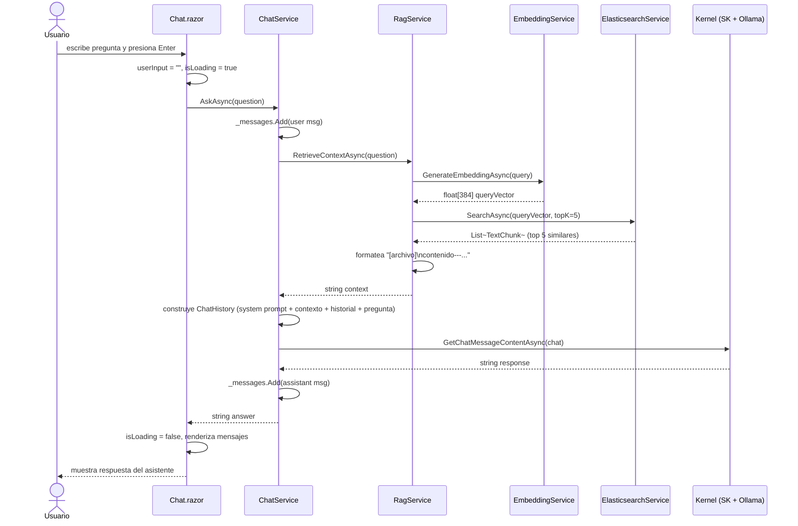
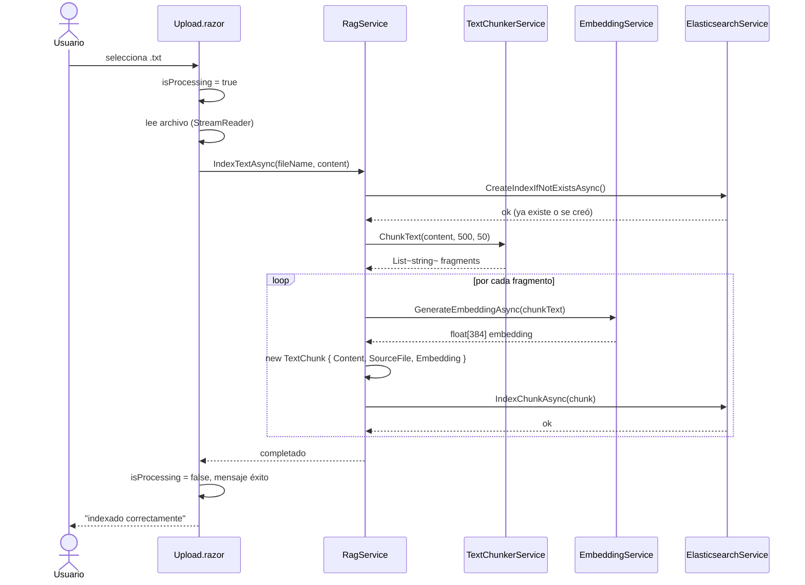
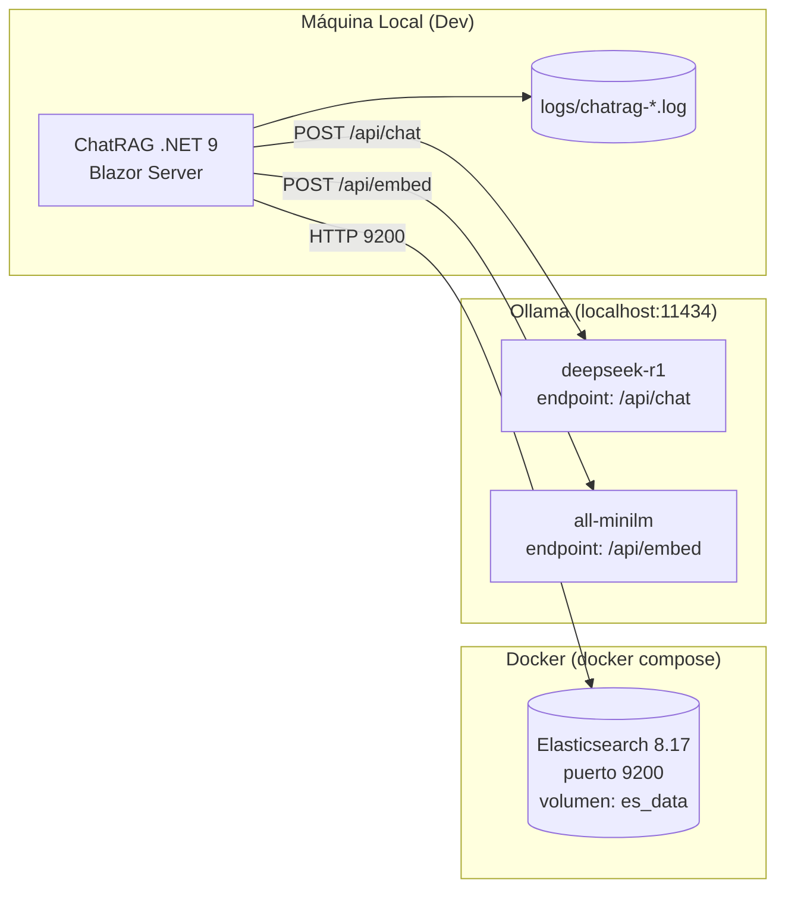

# Diagramas UML — ChatRAG

## Diagrama de Clases

```mermaid
classDiagram
    %% ==================== MODELOS ====================
    class ChatMessage {
        +string Role
        +string Content
        +DateTime Timestamp
    }

    class TextChunk {
        +string Id
        +string Content
        +string SourceFile
        +float[] Embedding
    }

    %% ==================== INTERFACES ====================
    class IChatService {
        <<interface>>
        +IReadOnlyList~ChatMessage~ Messages
        +Task~string~ AskAsync(string question)
        +void ClearHistory()
    }

    class IRagService {
        <<interface>>
        +Task IndexTextAsync(string fileName, string content)
        +Task~string~ RetrieveContextAsync(string query)
    }

    class IEmbeddingService {
        <<interface>>
        +Task~float[]~ GenerateEmbeddingAsync(string text)
    }

    class IElasticsearchService {
        <<interface>>
        +Task CreateIndexIfNotExistsAsync(int dimensions)
        +Task IndexChunkAsync(TextChunk chunk)
        +Task~List~TextChunk~~ SearchAsync(float[] queryEmbedding, int topK)
    }

    class ITextChunkerService {
        <<interface>>
        +List~string~ ChunkText(string text, int maxTokens, int overlap)
    }

    %% ==================== IMPLEMENTACIONES ====================
    class ChatService {
        -Kernel _kernel
        -IRagService _ragService
        -List~ChatMessage~ _messages
        -ILogger _logger
    }

    class RagService {
        -ITextChunkerService _chunker
        -IEmbeddingService _embedder
        -IElasticsearchService _elasticsearch
        -ILogger _logger
    }

    class EmbeddingService {
        -HttpClient _httpClient
        -const string Model = "all-minilm"
        +Task~float[]~ GenerateEmbeddingAsync(string text)
    }

    class ElasticsearchService {
        -ElasticsearchClient _client
        -const string IndexName = "text_chunks"
    }

    class TextChunkerService {
        +List~string~ ChunkText(string text, int maxTokens, int overlap)
    }

    %% ==================== PÁGINAS BLAZOR ====================
    class UploadPage {
        <<razor component>>
        +bool isProcessing
        +string statusMessage
        +bool isError
        +Task OnFileSelected(InputFileChangeEventArgs e)
    }

    class ChatPage {
        <<razor component>>
        +string userInput
        +bool isLoading
        +string statusMessage
        +Task SendMessage()
        +Task HandleKeyDown(KeyboardEventArgs e)
        +void ClearChat()
    }

    %% ==================== PUNTO DE ENTRADA ====================
    class Program {
        +static void Main()
        +WebApplicationBuilder builder
        -registra servicios en DI
        -configura middleware
    }

    %% ==================== EXTERNOS ====================
    class Kernel {
        <<Semantic Kernel>>
    }
    class HttpClient {
        <<.NET>>
    }
    class ElasticsearchClient {
        <<Elastic.Clients.Elasticsearch>>
    }

    %% ==================== RELACIONES ====================
    ChatService ..|> IChatService
    RagService ..|> IRagService
    EmbeddingService ..|> IEmbeddingService
    ElasticsearchService ..|> IElasticsearchService
    TextChunkerService ..|> ITextChunkerService

    ChatService o--> Kernel : usa
    ChatService o--> IRagService : inyectado
    ChatService *--> "lista" ChatMessage : contiene

    RagService o--> ITextChunkerService : inyectado
    RagService o--> IEmbeddingService : inyectado
    RagService o--> IElasticsearchService : inyectado

    EmbeddingService o--> HttpClient : inyectado

    ElasticsearchService o--> ElasticsearchClient : crea
    ElasticsearchService ..> TextChunk : indexa/busca

    TextChunkerService ..> TextChunk : produce fragmentos

    UploadPage o--> IRagService : inyectado
    ChatPage o--> IChatService : inyectado

    Program ..> ChatService : registra (Singleton)
    Program ..> RagService : registra (Singleton)
    Program ..> EmbeddingService : registra (Singleton)
    Program ..> ElasticsearchService : registra (Singleton)
    Program ..> TextChunkerService : registra (Singleton)
    Program ..> Kernel : registra (Singleton)
```



---

## Diagrama de Secuencia — Chat



---

## Diagrama de Secuencia — Subida de Documento



---

## Diagrama de Paquetes

```mermaid
packages
    package "ChatRAG" {
        package "Models" {
            component ChatMessage
            component TextChunk
        }
        package "Services" {
            component "Interfaces (IChatService, IRagService, IEmbeddingService, IElasticsearchService, ITextChunkerService)"
            component "Implementaciones (ChatService, RagService, EmbeddingService, ElasticsearchService, TextChunkerService)"
        }
        package "Pages" {
            component "Chat.razor"
            component "Upload.razor"
            component "Index.razor"
        }
        component "Program.cs"
    }
    package "Infraestructura externa" {
        component "Ollama (deepseek-r1 + all-minilm)"
        component "Elasticsearch 8.17"
    }
```

---

## Diagrama de Despliegue


